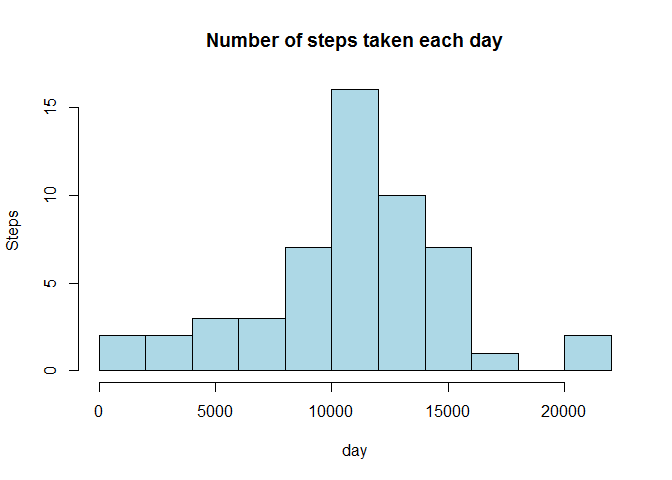
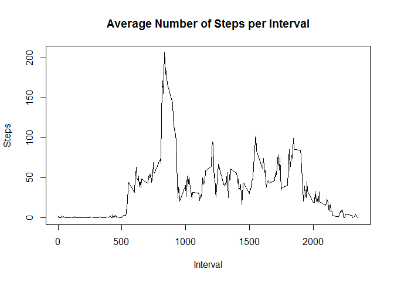
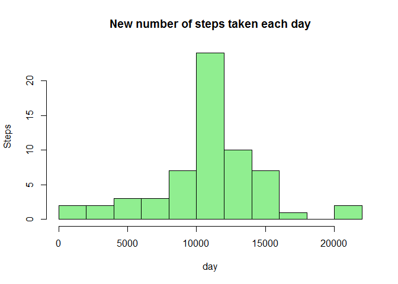
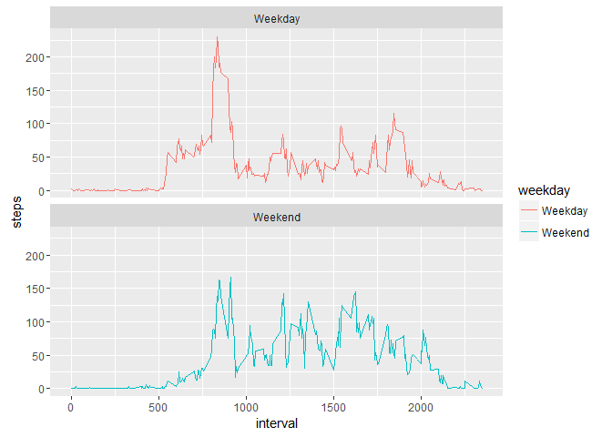

# Reproducible Research: Peer Assessment 1


##Overview

For this report, we will analyze the data from a personal activity monitoring device. This device collects data at 5 minute intervals through out the day. The data consists of two months of data from an anonymous individual collected during the months of October and November, 2012 and include the number of steps taken in 5 minute intervals each day.

Dataset can be found in [here]("https://github.com/amielsy/RepData_PeerAssessment1"")

The variables included in this dataset are:

steps: Number of steps taking in a 5-minute interval (missing values are coded as NA)  
date: The date on which the measurement was taken in YYYY-MM-DD format  
interval: Identifier for the 5-minute interval in which measurement was taken  

## Loading and preprocessing the data
We first extract the data, and change the date to a date format.

```r
activity<-read.csv("activity.csv")
activity$date<-as.Date(as.character(activity$date))
head(activity)
```

```
##   steps       date interval
## 1    NA 2012-10-01        0
## 2    NA 2012-10-01        5
## 3    NA 2012-10-01       10
## 4    NA 2012-10-01       15
## 5    NA 2012-10-01       20
## 6    NA 2012-10-01       25
```


## What is mean total number of steps taken per day?
We can calculate the total number of steps for each day by aggregating the data. Histogram of the total number of steps taken each day is shown. Take note that days with NA steps will not be included.


```r
stepsbyday<-aggregate(steps~date,activity,sum)
hist(stepsbyday$steps,col="light blue", breaks=10, xlab="day",
     ylab="Steps", main="Number of steps taken each day")
```

<!-- -->

Next, we calculate the mean and median number of steps per day


```r
mean(stepsbyday$steps)
```

```
## [1] 10766.19
```

```r
median(stepsbyday$steps)
```

```
## [1] 10765
```

## What is the average daily activity pattern?
We can calculate the total number of steps for each 5-minute interval across all days by aggregating the data.


```r
stepsbyinterval <- aggregate(steps ~ interval, activity, mean, na.rm=TRUE)
plot(stepsbyinterval$interval,stepsbyinterval$steps, type="l", xlab="Interval",
     ylab="Steps",main="Average Number of Steps per Interval")
```

<!-- -->

We then get the interval with maximum average steps

```r
stepsbyinterval$interval[stepsbyinterval$steps==max(stepsbyinterval$steps)]
```

```
## [1] 835
```
This means the interval with the highest number of steps is from 8:35-8:40  

## Imputing missing values
We first look at the number of NAs in the dataset

```r
sum(is.na(activity$steps))
```

```
## [1] 2304
```

We impute the missing value by taking the mean of the the same interval on other days. The new histogram with imputed data is shown

```r
imputedactivity<-activity
nodata<-is.na(activity$steps)
imputedactivity$steps[nodata]<-stepsbyinterval$steps[match(activity$interval, stepsbyinterval$interval)]
imputedstepsbyday<-aggregate(steps~date,imputedactivity,sum)
hist(imputedstepsbyday$steps,col="light green", breaks=10, xlab="day",
     ylab="Steps", main="New number of steps taken each day")  
```

<!-- -->
  
The mean and median of the new histogram is computed.

```r
mean(imputedstepsbyday$steps)
```

```
## [1] 10766.19
```

```r
median(imputedstepsbyday$steps)
```

```
## [1] 10766.19
```
The median without imputed data is 10765, which is slightly lower from the median with imputed data. Their means our the same since the imputation is based on mean.    
## Are there differences in activity patterns between weekdays and weekends?
First we create a new variable weekday for our imputed data, then aggregate the data to check the average day for weekday and weekend. The aggregated data is then plotted to compare weekend and weekday.


```r
imputedactivity$weekday<-ifelse(weekdays(imputedactivity$date)%in% 
                                  c("Saturday","Sunday"),"Weekend","Weekday")
stepsbyweekday<-aggregate(steps~interval+weekday,imputedactivity,mean)

library(ggplot2)
ggplot(stepsbyweekday, aes(x=interval, y=steps, color = weekday)) +
  geom_line() +
  facet_wrap(~weekday, ncol = 1, nrow=2)
```

<!-- -->
  
We can observe that at mornings, the person takes more steps on weekdays, although he takes more steps at other times on weekends.
